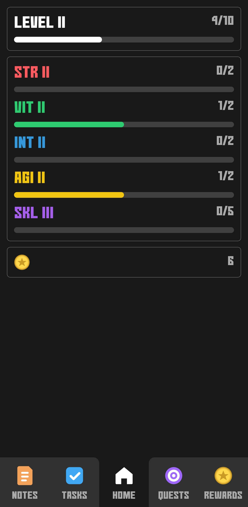
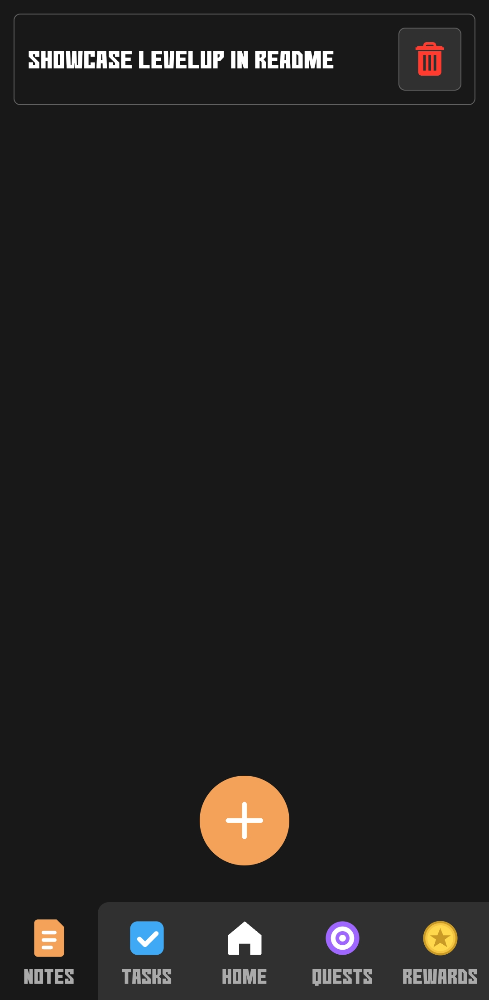
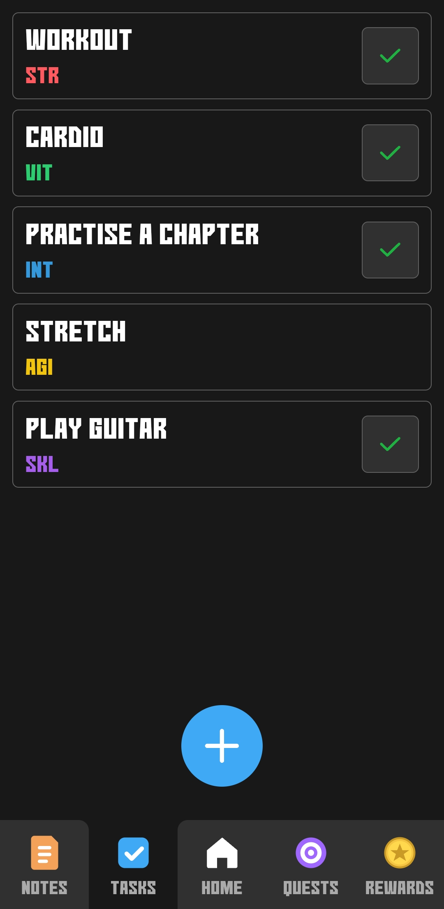
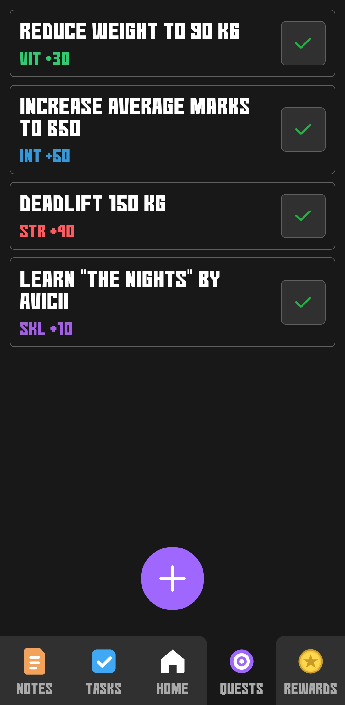
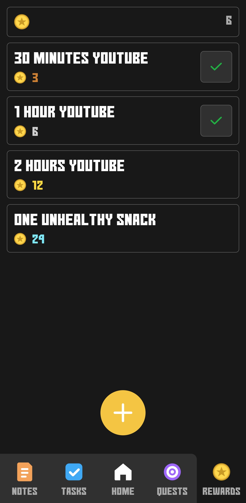
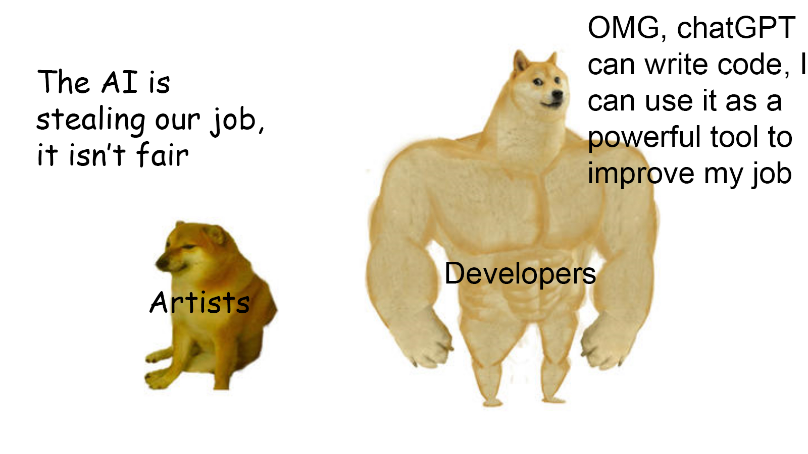

# Level Up
Level up IRL

## Quick Start
```console
$ npm run setup # Only once, after cloning the repo
$ npm run build
```

## Fonts
- [No Continue](https://www.1001fonts.com/no-continue-font.html) by [Gomarice](https://www.1001fonts.com/users/gomarice/)

## Sounds
- [Cash Register Purchase](https://pixabay.com/sound-effects/cash-register-purchase-87313/) by [freesound_community](https://pixabay.com/users/freesound_community-46691455/)
- [Purchase Success](https://pixabay.com/sound-effects/purchase-success-384963/) by [freesound_CrunchpixStudio](https://pixabay.com/users/freesound_crunchpixstudio-49769582/)
- [Level Up](https://pixabay.com/sound-effects/level-up-47165/) by [freesound_community](https://pixabay.com/users/freesound_community-46691455/)
- [GoodResult](https://pixabay.com/sound-effects/goodresult-82807/) by [freesound_community](https://pixabay.com/users/freesound_community-46691455/)

## Showcase

| Home | Notes | Tasks |
|---|---|---|
|  |  |  |

| Quests | Rewards |
|---|---|
|  |  |

## Icons
ChatGPT


